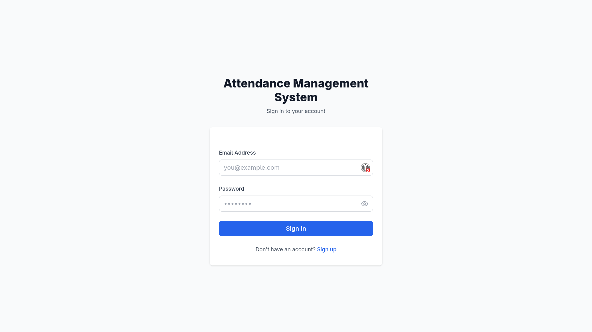
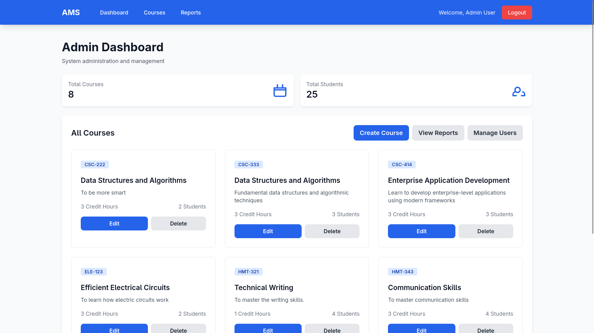
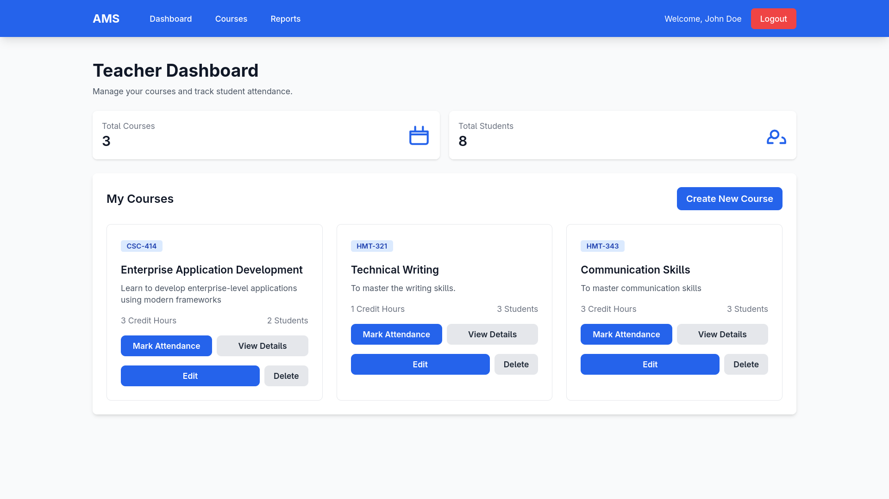
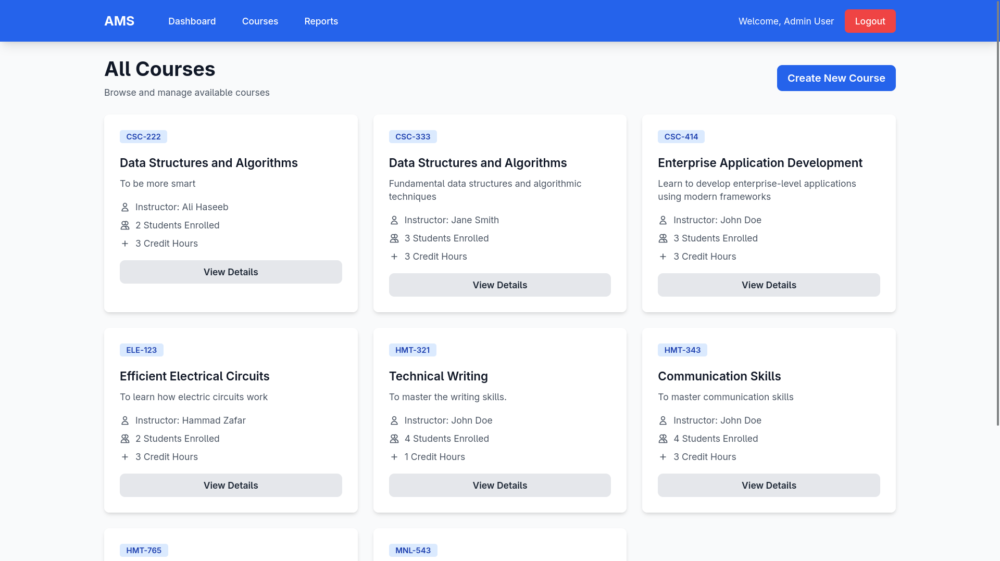
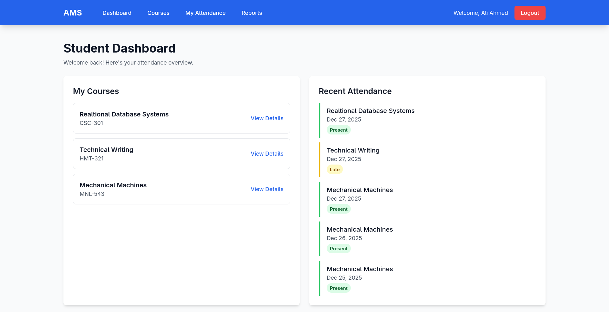

# AttendanceManagementSystem

A simple attendance management system built with ASP.NET Core (ASP.NET Core MVC) following a layered architecture (Core, Application, Infrastructure, Web). It provides role-based dashboards (Admin, Teacher, Student), course and enrollment management, attendance tracking, PDF/report export, and JWT-based authentication.



## Table of Contents
- [Project Overview](#project-overview)
- [Key Features](#key-features)
- [Tech Stack](#tech-stack)
- [Project Structure](#project-structure)
- [Prerequisites](#prerequisites)
- [Setup and Run](#setup-and-run)
- [Frontend Assets (Tailwind CSS)](#frontend-assets-tailwind-css)
- [Database Migrations & Seeding](#database-migrations--seeding)
- [Environment & Configuration](#environment--configuration)
- [Screenshots](#screenshots)
- [Admin / Teacher Notes](#admin--teacher-notes)
- [Users Page & Management](#users-page--management)
- [Troubleshooting & FAQ](#troubleshooting--faq)
- [Contributing](#contributing)
- [Next Steps / Roadmap](#next-steps--roadmap)
- [License](#license)

## Project Overview
AttendanceManagementSystem is an educational attendance tracking web application. It supports multiple roles (Admin, Teacher, Student). Admins can manage courses and users. Teachers can create and manage their own courses, mark attendance and generate reports. Students can enroll and view their attendance.

## Key Features
- JWT-based authentication and role-based authorization
- Admin, Teacher, and Student dashboards
- Course creation, update, delete (role-limited)
- Enrollment management
- Attendance marking and status tracking
- PDF and Excel/CSV export (QuestPDF / ClosedXML)
- Validation with FluentValidation-style validators

## Tech Stack
- .NET SDK: net9.0 (detected from `AMS.Web/AMS.Web.csproj`)
- ASP.NET Core MVC
- Entity Framework Core (DbContext in `AMS.Infrastructure/Data/ApplicationDbContext.cs`)
- QuestPDF, ClosedXML for export
- Tailwind CSS for UI styles (devDependency in `AMS.Web/package.json`)
- Node.js / npm (only required for building Tailwind CSS assets)

## Project Structure
- AMS.Web/ — Web UI project (entry point: `Program.cs`, views, controllers, wwwroot)
- AMS.Infrastructure/ — EF Core, configurations, `ApplicationDbContext`, `DbInitializer`
- AMS.Application/ — Services, DTOs, Helpers (Jwt, Password), Validators
- AMS.Core/ — Domain entities, enums, interfaces

## Prerequisites
- .NET SDK 9.0 (net9.0) — confirm with `dotnet --info`.
- Optional: Node.js (16+ recommended) and npm to build Tailwind CSS assets.
- A SQL Server instance (or change connection string to your preferred provider) — connection string is in `AMS.Web/appsettings.json` / `appsettings.Development.json`.

## Setup and Run
From the repository root, run:

```bash
# Restore NuGet packages for the solution
dotnet restore AttendanceManagementSystem.sln

# Build the solution
dotnet build AttendanceManagementSystem.sln

# Run the Web project (development)
dotnet run --project AMS.Web/AMS.Web.csproj
```

By default the app will run under the Kestrel URL printed in the console, or you can set `ASPNETCORE_URLS` / launch through Rider/Visual Studio.

## Frontend Assets (Tailwind CSS)
Tailwind is used for site styling. To build the CSS:

```bash
cd AMS.Web
npm install
npm run build:css    # produce minified CSS in wwwroot/css/site.css
# or during development
npm run watch:css
```

If you don't have Node/NPM or don't want to build assets, the project may still run but styling could be outdated.

## Database Migrations & Seeding
The EF Core DbContext is in `AMS.Infrastructure/Data/ApplicationDbContext.cs` and there is a `DbInitializer` in `AMS.Infrastructure/Data/DbInitializer.cs` responsible for seeding initial data (users, roles, sample courses).

To add and apply migrations (example):

```bash
# From repository root
# Add a migration (project that contains DbContext: AMS.Infrastructure; startup project: AMS.Web)
dotnet ef migrations add InitialCreate -p AMS.Infrastructure/AMS.Infrastructure.csproj -s AMS.Web/AMS.Web.csproj

# Apply migrations to the database
dotnet ef database update -p AMS.Infrastructure/AMS.Infrastructure.csproj -s AMS.Web/AMS.Web.csproj
```

If `DbInitializer` runs on application startup (common pattern), seeded users/roles are created when the web app starts. Check `AMS.Infrastructure/Data/DbInitializer.cs` for exact behavior and default credentials.

## Environment & Configuration
- appsettings.json / appsettings.Development.json: contains ConnectionStrings and other settings.
- JWT settings are present under `AMS.Application/Helpers/JwtSettings.cs` — ensure your secret is set via `appsettings` or environment variables.
- Common environment variables:
  - ASPNETCORE_ENVIRONMENT (Development/Production)
  - ConnectionStrings__DefaultConnection (or edit the JSON file)

## Screenshots
Admin Dashboard:



Teacher Dashboard:



Courses Page:



Student Dashboard:



Login Page:


> Tips: If images don't load in your Git viewer, ensure your repo host displays images from the repository root `Screenshots/` folder.

## Admin / Teacher Notes
- Default admin/teacher accounts (if any) are seeded by `AMS.Infrastructure/Data/DbInitializer.cs`. Inspect that file for seeded usernames/passwords and roles.
- Admin dashboard: can create courses. You asked to add update/delete + create buttons — check `AMS.Web/Views/Admin` for related Razor views and `Courses` controller actions.
- Teacher dashboard: teachers should see Update/Delete per their courses. If you change user roles, existing courses are not automatically deleted — they should remain in the DB unless your business logic deletes them. Verify `DbInitializer` or user delete logic in `AMS.Infrastructure`/repositories.

## Users Page & Management
A users management page should list, create, edit, and delete users. If not present, you can implement it under `AMS.Web/Controllers/UsersController.cs` and views in `AMS.Web/Views/Users/` wired to services in `AMS.Application/Services` and repositories in `AMS.Infrastructure/Repositories`.

## Troubleshooting & FAQ
- If you encounter runtime errors about missing migrations: run the `dotnet ef database update` command shown above.
- If deleting a user unexpectedly removes related courses, inspect cascade delete rules in `AMS.Infrastructure/Configurations/*Configuration.cs` and `OnModelCreating` in the DbContext.
- For CORS / auth issues, ensure JWT settings (issuer/audience/secret) are correct and tokens are issued with expected claims.

## Contributing
If you'd like to contribute:
1. Fork the repository.
2. Create a feature branch: `git checkout -b feature/my-feature`.
3. Make changes and add tests.
4. Submit a Pull Request with a clear description of changes.

Please follow the existing code style and patterns used across the projects.

## Next Steps / Roadmap
- Add Dockerfile(s) and docker-compose for local development
- Add CI (GitHub Actions) to build and run tests
- Create API documentation / Swagger augmentation (Swashbuckle is already referenced)
- Improve responsiveness of views (the UI currently needs mobile view fixes)
- Implement comprehensive user management UI if missing

## License
Add a LICENSE file if you wish to open-source this project. No license is provided by default.

---

If you'd like, I can also:
- Add a short CONTRIBUTING.md and LICENSE file.
- Create a minimal Dockerfile and a GitHub Actions CI workflow.
- Generate a short `docs/` folder with architecture notes.

Tell me which of the above you'd like next.
